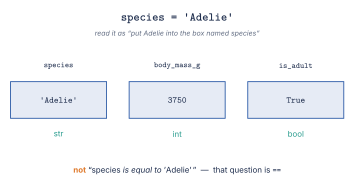
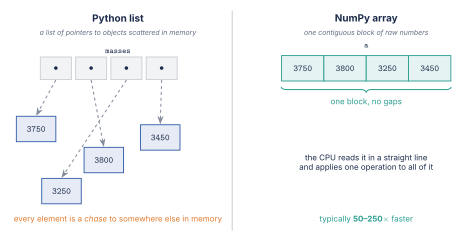
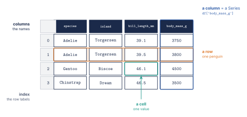
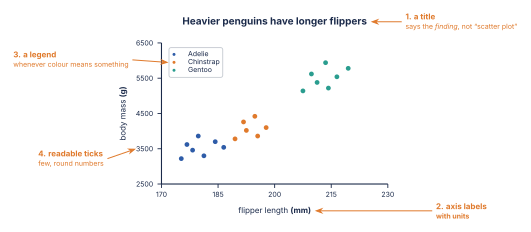
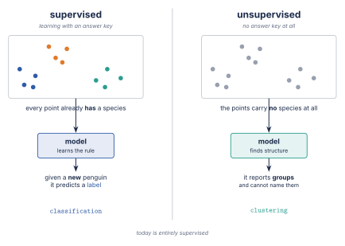
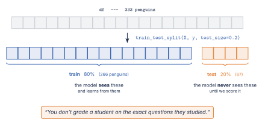
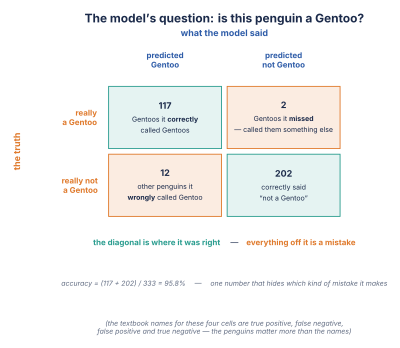
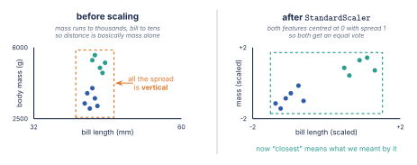
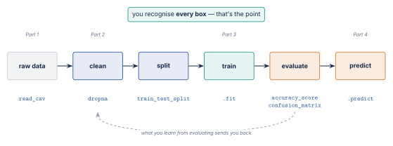

## Where we're going {.center}

By **1:30** you will have trained a machine learning model that classifies
penguins by species — and by **2:00** you will have done it again, alone, on
the Titanic.

::: {.fragment}
No installs. Just a browser. And we are going to move fast.
:::

::: {.notes}
This is the two-hour cut of the four-hour workshop. Same four steps, same
notebooks, half the talking. The rule for the whole session: show the idea,
type the code, move on. If the room needs an explanation, give it in the
notebook, not on a slide. Open NB1 and run cell 1 before anything else.
:::

---

## The two hours

| | | |
|---|---|---|
| **0:00 – 0:30** | Python for data | variables → NumPy → Pandas |
| **0:30 – 0:55** | Explore & visualise | missing values, groupby, the hue chart |
| **1:00 – 1:30** | Your first model | split → fit → predict → score |
| **1:30 – 2:00** | Compare & challenge | KNN, scaling, Titanic |

::: {.fragment}
👍 **thumbs up** — done · ✋ **flat hand** — stuck. Use both, all session.
:::

::: {.notes}
Two notebooks: NB1 for the first hour, NB2 for the second. NB2 loads its own
clean data in cell 1, so a broken NB1 never blocks the ML hour. Say that out
loud — it removes a real anxiety.
:::

---

## Before anything else {.center background-color="#2A9D8F"}

Open **NB1**. Click **Copy to Drive**. Run cell 1.

You should see a table of penguins.

::: {.fragment .keypoint}
Stuck later? **Runtime → Restart and run all.** You cannot break anything.
:::

::: {.notes}
First win inside 90 seconds. Only Shift+Enter, the runtime indicator and
Restart & run all — nothing else about Colab matters today.
:::

---

## Part 1 · Python for data {.center background-color="#1B2A4A"}

::: {.whereami}
0:05 – 0:30 · by 0:30 you will be filtering a real table of 344 penguins
:::

---

## Values, names and types {.smaller}

::: {.columns}
::: {.column width="55%"}
{width="100%"}
:::
::: {.column width="45%"}
| you write | type |
|---|---|
| `'Adelie'` | `str` — text, in quotes |
| `3750` | `int` |
| `39.1` | `float` |
| `True` | `bool` |
:::
:::

::: {.keypoint}
`=` puts a value in a box. `==` asks a question.
:::

---

## Lists by position, dicts by name {.smaller}

::: {.columns}
::: {.column width="50%"}
```python
masses = [3750, 3800, 3250, 3450]
masses[0]     # 3750 — counts from 0
masses[-1]    # 3450 — from the end
masses[:2]    # [3750, 3800]
len(masses)   # 4
```
A column of a table is a list.
:::
::: {.column width="50%"}
```python
penguin = {'species': 'Adelie',
           'mass': 3750,
           'island': 'Torgersen'}
penguin['mass']   # 3750
```
A row of a table is a dict.
:::
:::

::: {.notes}
Zero-indexing is the one thing worth ten seconds here. Everything else is in
the notebook.
:::

---

## Loops, choices, functions {.smaller}

::: {.columns}
::: {.column width="50%"}
```python
for m in masses:
    if m > 3700:
        print(m, 'heavy')
    else:
        print(m, 'light')
```
The **indent** is the syntax — four spaces means "inside".
:::
::: {.column width="50%"}
```python
def size_label(mass_g):
    return ('large' if mass_g > 3700
            else 'small')

size_label(3750)    # 'large'
```
`def` names a piece of work. Calling it runs it.
:::
:::

---

## Why NumPy? Speed {.smaller .nostretch}

{width="58%" fig-align="center"}

```python
big = np.random.rand(1_000_000)
%timeit sum(big)      # milliseconds
%timeit big.sum()     # microseconds — 50–250× faster
```

::: {.notes}
Run the %timeit live in the notebook. Sixty seconds, and the "why not a
list" question is gone for good.
:::

---

## One operation, every element {.smaller}

```python
a = np.array([3750, 3800, 3250, 3450])

a * 2            # no loop: [7500 7600 6500 6900]
a.mean()         # 3562.5
a > 3700         # [ True  True False False]  — one answer per element
a[a > 3700]      # [3750 3800]                — keep only the True ones
(a > 3700).sum() # 2                          — True counts as 1
```

::: {.keypoint}
That mask is exactly how you will filter a table.
:::

---

## A DataFrame is a spreadsheet you can program

{width="80%" fig-align="center"}

---

## Selecting and filtering {.smaller}

| you write | you get |
|---|---|
| `df['body_mass_g']` | one column → a **Series** |
| `df[['species', 'body_mass_g']]` | a list of columns → a **DataFrame** |
| `df[df['body_mass_g'] > 4500]` | the rows where the mask is `True` |
| `df[(df.species == 'Gentoo') & (df.body_mass_g > 5000)]` | two conditions |

::: {.keypoint}
`&` not `and`, and **parentheses around each condition**.
:::

::: {.notes}
Single vs double brackets causes the most common error in the ML hour — flag
it now.
:::

---

## Exercise 1 {background-color="#E07A2C"}

**NB1 → Exercise 1.** Fill the blanks.



1. A function that labels a flipper `'long'` or `'short'`
2. Count the penguins above the mean mass
3. Count the Chinstraps

::: {.notes}
Circulate, do not present. If a third of the room is still on task 1 at the
3-minute mark, stop the clock and do it together on screen.
:::

---

## Checkpoint {.center}

```python
df[df['body_mass_g'] > 4000].shape[0]
```

A penguin, a number, or a table?

::: {.fragment .keypoint}
A number — the count of penguins over 4000 g.
:::

---

## Part 2 · Explore & visualise {.center background-color="#1B2A4A"}

::: {.whereami}
0:30 – 0:55 · by 0:55 you will have made the chart the second hour depends on
:::

---

## The first three questions {.smaller}

| question | the line |
|---|---|
| What do the numbers look like? | `df.describe()` |
| How many of each category? | `df['species'].value_counts()` |
| What is missing? | `df.isna().sum()` |

::: {.keypoint}
Run all three on any new dataset, before anything else.
:::

---

## Missing values are a decision {.smaller}

| option | what it costs you |
|---|---|
| **drop the rows** — `df.dropna()` | data; and dropped rows are rarely random |
| **fill with a constant** | invents a value that may be nonsense |
| **fill with the median** (*imputation*) | keeps rows, shrinks the spread |

On the Titanic, a median fill puts 177 people at age 28: the 25–30 bin goes
from **106 → 283**.

::: {.keypoint}
You are not recovering the value. You are inventing one — so fit it on train
only, and record what you filled.
:::

::: {.notes}
Ask the room what dropna loses before running it (11 of 344 — cheap here).
The Titanic numbers are what they will produce themselves at 1:45.
:::

---

## Split, apply, combine {.smaller}

```python
df.groupby('species')['body_mass_g'].mean()
```

| part | what it does |
|---|---|
| `groupby('species')` | **split** — one bucket per species |
| `['body_mass_g']` | the column to summarise |
| `.mean()` | **apply** — each bucket to one number |
| *(result)* | **combine** — one row per group |

---

## Charts: label them {.smaller}

{width="70%" fig-align="center"}

histogram → one variable · scatter → two · scatter + colour → a third

---

## The hinge of the whole workshop {.smaller}

::: {.columns}
::: {.column width="50%"}
```python
sns.scatterplot(
    data=df,
    x='flipper_length_mm',
    y='body_mass_g')
```
A cloud.
:::
::: {.column width="50%"}
```{.python code-line-numbers="5"}
sns.scatterplot(
    data=df,
    x='flipper_length_mm',
    y='body_mass_g',
    hue='species')
```
**Three groups.**
:::
:::

::: {.fragment .keypoint}
Those groups are what a classifier learns to draw a line between.
:::

::: {.notes}
The one sentence you must not skip, even in the fast version. Say it slowly.
:::

---

## Practice {background-color="#E07A2C"}

**NB1 → Independent practice.** Questions 1–3, in pairs.



1. Which species is heaviest on average?
2. How many penguins on each island?
3. Do flipper length and mass move together? Show it.

::: {.notes}
Question 4 (the open chart) is homework in this version. At 0:53 ask the
checkpoint on the next slide, then break.
:::

---

## Checkpoint {.center}

Flipper length and body mass: **r = 0.87**.

Do longer flippers *cause* more mass?

::: {.fragment .keypoint}
No. Both are driven by species and overall size.
:::

---

## Break — 5 minutes {background-color="#2A9D8F" .center}

Open **NB2** and run cell 1 before you stand up.

---

## Part 3 · Your first model {.center background-color="#1B2A4A"}

::: {.whereami}
1:00 – 1:30 · by 1:30 you will have a trained, scored classifier
:::

---

## Machine learning in one slide {.smaller}

::: {.columns}
::: {.column width="50%"}
**Normal programming** — you write the rule.

```python
if flipper > 205:
    return 'Gentoo'
```
:::
::: {.column width="50%"}
**Machine learning** — you show examples; the computer writes the rule.

```python
model.fit(X, y)
```
:::
:::

{width="48%" fig-align="center"}

---

## Features, labels, and the split {.smaller}

::: {.columns}
::: {.column width="45%"}
```python
X = df[['flipper_length_mm',
        'body_mass_g',
        'bill_length_mm']]  # features
y = df['species']           # label
```
`X` double brackets, `y` single.
:::
::: {.column width="55%"}
{width="100%"}
:::
:::

::: {.keypoint}
You don't grade a student on the questions they studied.
:::

---

## Underfit, good fit, overfit {.smaller}

| | on the training data | on a penguin it has never seen |
|---|---|---|
| **underfit** | poor | poor |
| **good fit** | good | **good** |
| **overfit** | *perfect* | poor |

::: {.keypoint}
A model that memorised scores brilliantly and is useless on the next penguin.
The test set is the only column that counts.
:::

---

## split → fit → predict → score {.smaller}

```{.python code-line-numbers="|1-2|4-5|7|8"}
X_train, X_test, y_train, y_test = train_test_split(
    X, y, test_size=0.2, random_state=42)

model = LogisticRegression(max_iter=1000)
model.fit(X_train, y_train)            # it learns here

preds = model.predict(X_test)          # 67 unseen penguins
accuracy_score(y_test, preds)          # 0.97
```

::: {.keypoint}
Every model you ever meet uses this same four-step shape.
:::

::: {.notes}
Walk the highlight with the arrow keys, typing along in NB2. Pause on .fit()
— it is what the whole workshop has been building towards. random_state is
reproducibility; test_size=0.2 holds back 20% for the exam.
:::

---

## What `.fit()` learned {.smaller}

$$z = w_1x_1 + w_2x_2 + w_3x_3 + b \qquad\qquad p = \frac{1}{1 + e^{-z}}$$

- $x$ are the features, $w$ how much each one counts, $b$ an offset
- the sigmoid squashes any score $z$ into a probability between 0 and 1
- `.fit()` is the search for good $w$ and $b$ — nothing more

::: {.keypoint}
`model.predict_proba(X_test)` shows the probabilities. A 0.51 and a 0.99 are
both "Gentoo" — don't treat them the same.
:::

---

## 97% of what? {.smaller}

::: {.columns}
::: {.column width="50%"}
{width="86%"}
:::
::: {.column width="50%"}
```python
wrong = X_test[preds != y_test]
wrong
```
Pull up one wrong penguin. It usually sits on the boundary — a small Gentoo,
a large Chinstrap.
:::
:::

::: {.keypoint}
Accuracy is a number. A wrong row is a story.
:::

---

## Checkpoint {.center}

97% on **test**. 100% on **train**. Good news?

::: {.fragment .keypoint}
Not necessarily — the gap is the overfitting signal.
:::

---

## Part 4 · Compare & challenge {.center background-color="#1B2A4A"}

::: {.whereami}
1:30 – 2:00 · by 2:00 you will have run the whole pipeline unaided
:::

---

## K-Nearest Neighbors {.smaller}

To classify a new penguin: find the **K** closest ones, take a vote.

$$d = \sqrt{(x_1 - x_2)^2 + (y_1 - y_2)^2}$$

| | who sets it | example |
|---|---|---|
| **parameter** | the model, during `.fit()` | logistic regression's $w$ and $b$ |
| **hyperparameter** | **you**, before `.fit()` | `n_neighbors=5` |

::: {.notes}
K=1 is jagged and trusts noise; very large K smooths away real structure.
Let them try a few K values in NB2 while you move to the trap.
:::

---

## The scaling trap {.smaller}

| feature | typical value | 2 penguins differ by | **squared** |
|---|---|---|---|
| `bill_length_mm` | 39.1 | 5 mm | 25 |
| `body_mass_g` | 3750 | 500 g | **250 000** |

{width="66%" fig-align="center"}

::: {.keypoint}
Unscaled **0.82** → scaled **0.99**. Same model, same data, same K.
:::

::: {.notes}
Run it unscaled first in NB2 and ask why it is worse before showing this.
:::

---

## Fit the scaler on train only {.smaller}

```python
scaler = StandardScaler().fit(X_train)      # TRAIN only
knn.fit(scaler.transform(X_train), y_train)
knn.score(scaler.transform(X_test), y_test)
```

::: {.keypoint}
Fit anything on all the data and the test set leaks in: your score becomes a
flattering lie. Same rule as the imputer.
:::

---

## Titanic {background-color="#E07A2C"}

**NB2 → The Titanic challenge.** In pairs.



1. Load and explore
2. Handle the missing `Age`
3. Make `Sex` numeric *(hint cell provided)*
4. **Split, fit, predict, score**
5. *Stretch:* does `Fare` help?

::: {.notes}
Step 4 is the real assessment. At the end, ask: what does always guessing
"did not survive" score? 0.59 — so 0.80 is real, but only because we checked
the baseline.
:::

---

## What you built today {.center}

{width="94%" fig-align="center"}

::: {.keypoint}
split, fit, predict, score — and always look at one it got wrong.
:::

---

## Three next steps {.center background-color="#2A9D8F"}

1. **A course** — *[your recommendation]*
2. **A dataset** — run this pipeline on something you care about
3. **A community** — *[your recommendation]*

Solutions notebook is now unlocked · content CC BY 4.0 · code MIT

::: {.notes}
Ask each student to name one thing they want to learn next.
:::
